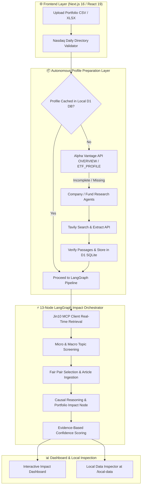

<div align="center">

# 📈 Portfolio News Impact Agent

**A Local-First, Privacy-Preserving Multi-Agent System Connecting Global Financial News to Stock & ETF Portfolios**

[English](README.md) | [简体中文](README_CN.md)

[](https://nextjs.org/)
[](https://js.langchain.com/docs/langgraph)
[](https://ollama.com)
[](https://www.typescriptlang.org/)
[](https://developers.cloudflare.com/d1/)
[](LICENSE)

*Analyze market-moving news against your personal portfolio with 100% data privacy, zero-hallucination evidence guardrails, and deterministic causal reasoning.*

[Key Features](#-key-features) • [Agent Architecture](#-agent-architecture--workflow) • [Quick Start Guide](#-quick-start--setup) • [Environment Variables](#%EF%B8%8F-environment-variables) • [Local Inspector](#-local-data-inspector) • [Privacy & Safety](#-privacy--safety-scope)

⭐ **If you find this project useful or interesting, please give it a star on GitHub!**

---

</div>

## ✨ Key Features

- 🔒 **100% Privacy & Local-First Execution**: Your portfolio holdings, CSV files, and AI analysis prompts **never leave your local machine**.
- 🤖 **Multi-Agent Architecture**:
  - **Company Research Agent**: Discovers company profiles, operating models, and sector exposures for stocks, ADRs, and REITs.
  - **Fund Research Agent**: Parses ETF & Closed-End Fund strategies, benchmark indexes, macro exposures, daily reset/leverage mechanics, and dated top holdings.
  - **13-Node LangGraph Orchestrator**: Manages parallel news ingestion, micro/macro screening, fair pair selection, and causal impact evaluation.
- 📡 **Jin10 MCP Integration**: Built on the official **Model Context Protocol (MCP)** specification (`2025-11-25`) to stream real-time financial market flashes, news articles, and economic calendar events.
- 🛡️ **Zero-Hallucination Evidence Engine**: Facts and fund holdings are verified *only* when raw scraped text matches exact local passage IDs stored in Cloudflare D1. Model memory claims remain explicitly unverified.
- 🧠 **Local LLM Schema Enforcement**: Runs locally on **Ollama (Qwen 3.5 4B)** with strict JSON schema validation and automatic 1-shot micro-schema retries on output errors.
- 🏛️ **Nasdaq Exchange Symbol Validation**: Automatically verifies portfolio tickers against daily Nasdaq/Other-Exchange directory caches to ensure valid US-listed securities before processing.
- 📊 **Dynamic Micro & Macro Impact Scoring**: Evaluates micro impact (company-specific news) and macro impact (interest rates, supply chains, inflation) with evidence-capped confidence scoring (Headline: 55%, Flash: 65%, Article: 85%).
- 🔎 **Mandarin Local Data Inspector**: Includes an interactive local database inspector at `/local-data` to audit stored company facts, fund holdings, evidence text, and source URLs.

---

## 🏗️ Agent Architecture & Workflow



---

## ⚙️ Quick Start & Setup

Follow these steps to get your local environment up and running in minutes.

### 📋 Prerequisites

1. **Node.js**: Version `22.13.0` or higher.
2. **Ollama**: Installed and running locally ([Download Ollama](https://ollama.com/)).
3. **API Keys** (Free tier supported):
   - **Jin10 MCP Token**: Real-time financial news API token.
   - **Alpha Vantage Key**: Structured company & ETF overview lookup (Free tier: 25 requests/day).
   - **Tavily API Key**: Bounded web search & passage extraction for fallback research agents.

---

### 🚀 Step-by-Step Installation

#### 1. Clone the Repository
```bash
git clone https://github.com/YOUR_USERNAME/Portfolio-News-Impact-Agent.git
cd Portfolio-News-Impact-Agent
```

#### 2. Install Dependencies
```bash
npm install
```

#### 3. Pull the Local AI Model
Make sure Ollama is running, then pull the model:
```bash
ollama pull qwen2.5:3b # or qwen3.5:4b depending on your local model tag
```
*Note: The application connects to local Ollama at `http://127.0.0.1:11434` by default.*

#### 4. Configure Environment Variables
Copy the example environment file:
```bash
cp .env.example .env.local
```
Open `.env.local` and add your private API keys:
```env
JIN10_MCP_TOKEN=your_jin10_mcp_token_here
ALPHA_VANTAGE_API_KEY=your_alpha_vantage_api_key_here
TAVILY_API_KEY=your_tavily_api_key_here
```

#### 5. Start the Development Server
```bash
npm run dev
```

#### 6. Open the Application
Open your browser and navigate to:
- **Main Dashboard**: `http://localhost:3000`
- **Local Data Inspector**: `http://localhost:3000/local-data`

---

## 💡 How to Test the Agent

1. **Upload a Portfolio**:
   - You can upload your own CSV/XLSX portfolio or use the sample file located at `public/sample-portfolio.csv`.
   - The file supports broker fields such as `Symbol`, `Market Value`, or `% of Portfolio`.

2. **Automatic Profile Generation**:
   - On upload, the system automatically checks local D1 database records.
   - Any new stock or ETF ticker undergoes structured API resolution (Alpha Vantage) or fallback research via Tavily + local Qwen 3.5.

3. **Run News Impact Analysis**:
   - The 13-node LangGraph pipeline retrieves current Jin10 market flashes, evaluates micro news against holdings and macro trends against sectors, and presents causal reasoning directly on your dashboard.

4. **Inspect Local Database**:
   - Visit `http://localhost:3000/local-data` to inspect cached exchange directories, verified company facts, ETF constituent holdings, and raw source text passages.

---

## ⚙️ Environment Variables

| Variable | Description | Required | Default / Note |
| :--- | :--- | :---: | :--- |
| `JIN10_MCP_TOKEN` | Token for Jin10 MCP news client endpoint | Yes | Private API Token |
| `ALPHA_VANTAGE_API_KEY` | Key for Alpha Vantage overview & ETF profile lookup | Yes | Free tier (25 req/day) |
| `TAVILY_API_KEY` | Key for Tavily web search & raw page extraction | Yes | Bounded research fallback |
| `OLLAMA_HOST` | Local Ollama API URL | No | `http://127.0.0.1:11434` |

---

## 🔍 Local Data Inspector

This project includes a dedicated local data audit tool at `/local-data` that allows you to inspect:
- **US Security Registry**: Confirmed Nasdaq and exchange symbol lookup status.
- **Company Profiles**: Stored operating models, sector tags, and verified facts.
- **Fund Profiles**: ETF benchmarks, leverage flags, inverse flags, and dated top holdings.
- **Evidence Vault**: Exact passage text, verification dates, source URLs, and status (`verified`, `conflicted`, `unverified`).

---

## 🛡️ Privacy & Safety Scope

- 🔒 **100% Local & Personal**: Designed as a personal, local-only research assistant.
- 🛑 **No Automatic Trading**: The tool performs informational news impact analysis only and **does not execute trades** or integrate with brokers.
- 🛡️ **Zero Data Leakage**: Portfolio files, weights, and LLM prompts remain strictly on your local machine and are never uploaded to third-party services.

---

## 🤝 Contributing & Giving a Star

Contributions, bug reports, and feature requests are welcome! Feel free to check the [Issues](https://github.com/YOUR_USERNAME/Portfolio-News-Impact-Agent/issues) page.

If you find this repository inspiring or useful for your own multi-agent & local AI builds, please consider leaving a **⭐ Star**!

---

## 📄 License

This project is licensed under the [MIT License](LICENSE).
